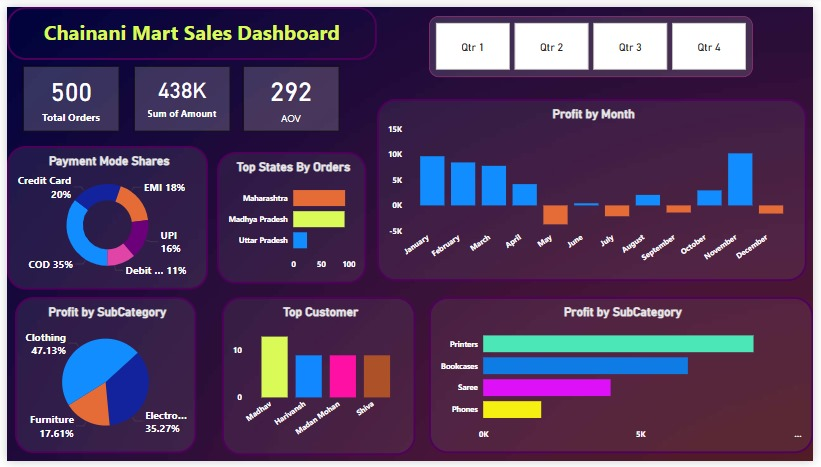
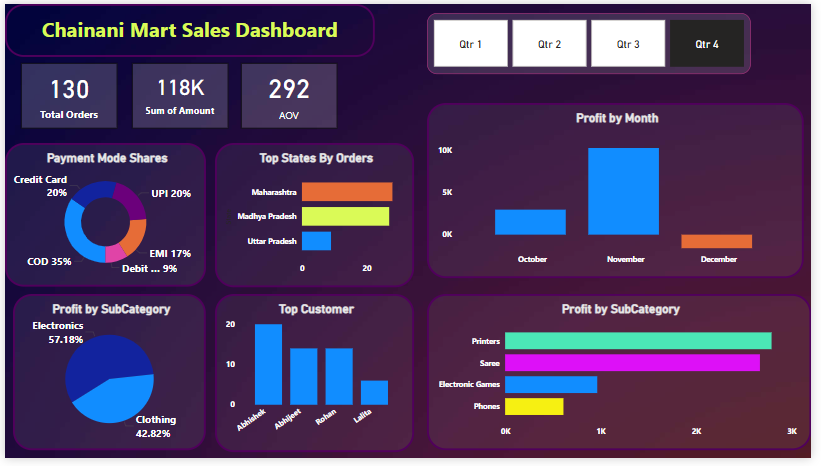

# 📊 Chainani Mart Sales Dashboard - Power BI Project  

## 🔥 Overview  
This **Power BI Sales Dashboard** provides an in-depth analysis of sales performance, helping businesses make **data-driven decisions** efficiently. The dashboard visualizes key sales metrics, customer behavior, and product performance using interactive charts and reports.  

## 📌 Features  
✅ **Total Orders, Revenue & AOV** – Quick snapshot of business performance  
✅ **Payment Mode Shares** – Analyzing customer payment preferences  
✅ **Top Performing States** – Identifying key markets  
✅ **Profit by Month & Subcategory** – Seasonal trends and product profitability  
✅ **Top Customers** – Recognizing valuable customers  

## 🌟 Real-World Use Case  
This project is useful for businesses and e-commerce platforms to track sales trends, optimize inventory, and make strategic decisions using **Power BI visualizations**.  

## 🖼️ Dashboard Preview  
### 🏆 Main Dashboard View  


### 📊 Quater 3  
  

### 📈 Quater 4 


---  

## 🚀 Getting Started  

### 📅 Clone or Download the Project  
To use this project, follow these steps:  

**1️⃣ Clone the repository:**  
```sh  
git clone https://github.com/your-github-username/chainani-mart-sales-dashboard.git  
```  
OR  

**📂 Download Manually:**  
- Click on the "**Code**" button (Green) at the top right.  
- Select "**Download ZIP**".  
- Extract the ZIP file to access the Power BI (.pbix) file.  

---  

## 📂 Project Files  
- `Chainani_Mart_Sales_Dashboard.pbix` → Power BI dashboard file  
- `Dataset.xlsx` → The dataset used for analysis  
- `README.md` → Project documentation  
- `dashboard_image.png` → Screenshot of the dashboard  

---  

## 🛠️ Tools & Technologies  
- **Power BI** – For data visualization & report building  
- **Microsoft Excel** – Data preprocessing & cleaning  
- **DAX (Data Analysis Expressions)** – Custom calculations  

---  

## 📌 How to Use the Dashboard?  
1️⃣ Open **Power BI Desktop**  
2️⃣ Click **File → Open** and select `Chainani_Mart_Sales_Dashboard.pbix`  
3️⃣ Interact with the filters & visualizations to explore insights  

---  

## 📈 Learnings from This Project  
✔️ **Data cleaning & transformation** using Power BI  
✔️ **Building interactive reports** with slicers & filters  
✔️ **Using DAX for advanced calculations**  
✔️ **Real-world business intelligence application**  

---  

## 💡 Inspiration & Tutorial Reference  
This project was inspired by a tutorial from **[YouTube Video Link]** 📌  

---  

## 🙌 Connect with Me  
🎼 **Portfolio:** [ayushchainani.me](https://ayushchainani.me)   
🎓 **LinkedIn:** [linkedin.com/in/ayushchainani](https://www.linkedin.com/in/ayushchainani)  

---  

## ⭐ Contribute  
If you find this project useful, feel free to **⭐ Star this repository** and fork it! Contributions are welcome!  

---  

## 🏆 Acknowledgments  
🔹 Power BI Community  
🔹 Data Science & BI Enthusiasts  

---  

# 📢 Let's Decode Data Together! 🚀  
#PowerBI #DataAnalytics #BusinessIntelligence #DataVisualization #SalesDashboard #AI #MachineLearning  

